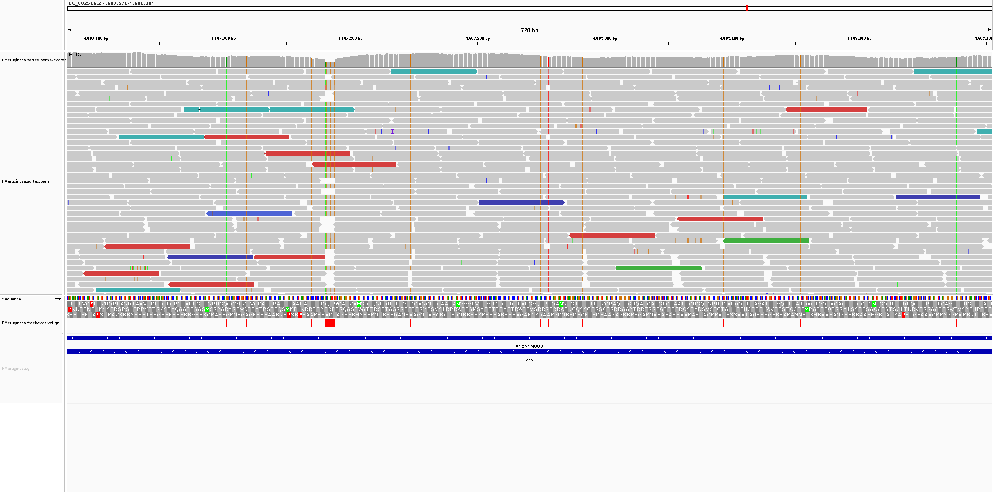
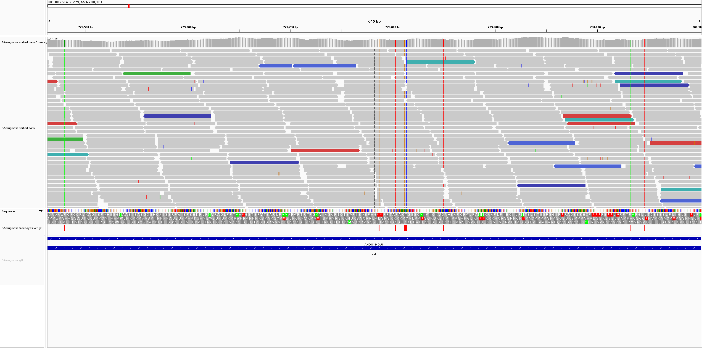
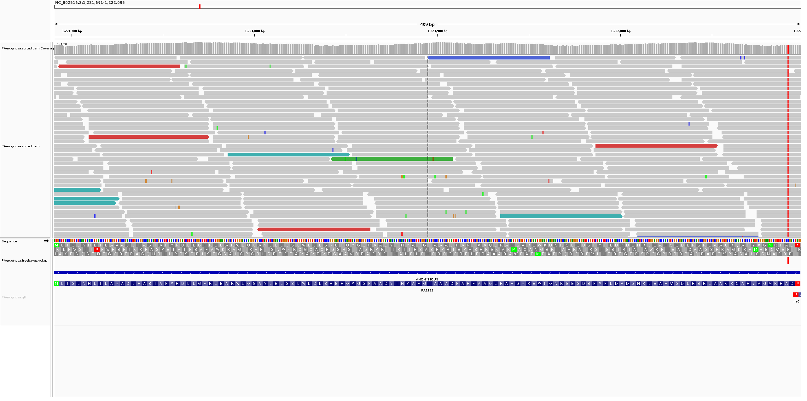

# Влияние меди на антибиотикорезистентность у синегнойной палочки

## Задание
Скачайте данные SRR12905311 из SRA NCBI. Опишите, что за исследование проводилось, на каком организме. Можно воспользоваться GEO (GSM4862160).  
Препроцессируйте риды (оценка качества, триммирование по необходимости, выравнивание на референс), и проведите поиск SNP.  
Выберите 3-4 выявленные мутации. Проверьте по NCBI, каким генам они принадлежат, и предположите, как эти мутации могут влиять на жизнедеятельность организма.  
Не забывайте, что ваши мутации не относятся к человеку.

## Используемое ПО
```bash
sudo apt install fastp fastqc multiqc
sudo apt install spades; pip3 install quast
sudo apt install samtools bwa
sudo apt install kraken2 centrifuge
sudo apt install samtools bamtools freebayes bedtools tabix bcftools  # libvcflib-tools
sudo apt install busco augustus prokka igv
sudo apt install mafft raxml iqtree bedtools
sudo apt install snpeff genometools bedtools
sudo apt install ea-utils sickle seqtk bowtie2 muscle

bash project.sh
```

## [Bash-скрипт для обработки данных](project.sh)
```bash
#!/bin/bash -x

# [SRX9370194: GSM4862160: PAO1_MIC_Exp5_t=72 (DNA-seq); Pseudomonas aeruginosa; OTHER](https://www.ncbi.nlm.nih.gov/sra/SRR12905311)
# Study: Do Copper enhance antibiotic resistance (AR) in resistant bacteria and/or induce AR in sensitive bacteria? [DNA-seq]
# Organism: [Pseudomonas aeruginosa (Синегнойная палочка)](https://www.ncbi.nlm.nih.gov/Taxonomy/Browser/wwwtax.cgi?mode=Info&id=287)
# Reference genome: [ASM676v1](https://www.ncbi.nlm.nih.gov/datasets/genome/GCF_000006765.1)
# GEO Accession: [GSM4862160](https://www.ncbi.nlm.nih.gov/geo/query/acc.cgi?acc=GSM4862160)
# SRA: [SRP288731](https://trace.ncbi.nlm.nih.gov/Traces/?view=study&acc=SRP288731)
# BioProject: [PRJNA672287](https://www.ncbi.nlm.nih.gov/bioproject/PRJNA672287)
# GEO: [GSE160188](https://www.ncbi.nlm.nih.gov/geo/query/acc.cgi?acc=GSE160188)

ORGANISM=PAeruginosa
GENOME=GCF_000006765.1
RUN=SRR12905311

ABRICATE=~/Apps/abricate/bin/abricate
QUALIMAP=~/Apps/qualimap_v2.3/qualimap


RESULT_DIR=/mnt/c/Users/Asus/BioGen
[ -d ${RESULT_DIR} ] && rm -rf ${RESULT_DIR} && mkdir ${RESULT_DIR}

#mkdir -p project && cd project

mkdir -p reads ref

# Скачивание ридов в формате FASTQ
[ -f reads/${RUN}_1.fastq.gz ] || wget -P reads ftp://ftp.sra.ebi.ac.uk/vol1/fastq/SRR129/011/SRR12905311/SRR12905311_1.fastq.gz
[ -f reads/${RUN}_2.fastq.gz ] || wget -P reads ftp://ftp.sra.ebi.ac.uk/vol1/fastq/SRR129/011/SRR12905311/SRR12905311_2.fastq.gz

# Скачивание референсного генома для Pseudomonas aeruginosa в формате FASTA и GFF3
[ -f ${GENOME}.zip ] || curl -OJX GET "https://api.ncbi.nlm.nih.gov/datasets/v2alpha/genome/accession/GCF_000006765.1/download?include_annotation_type=GENOME_FASTA,GENOME_GFF,RNA_FASTA,CDS_FASTA,PROT_FASTA,SEQUENCE_REPORT&filename=GCF_000006765.1.zip" -H "Accept: application/zip"
unzip ${GENOME}.zip
mv ncbi_dataset/data/${GENOME}/${GENOME}_ASM*_genomic.fna ref/${ORGANISM}.fasta
mv ncbi_dataset/data/${GENOME}/genomic.gff ref/${ORGANISM}.gff
rm -rf ncbi_dataset README.md

rm -rf quality_check && mkdir -p quality_check
# Тримминг
mkdir -p trimmed
fastp --overrepresentation_analysis --trim_poly_g \
    -f 12 -t 2 \
    -h quality_check/${RUN}.fastp.html -j quality_check/${RUN}.fastp.json --thread `nproc` \
    -i reads/${RUN}_1.fastq.gz -I reads/${RUN}_2.fastq.gz -o trimmed/${RUN}_1.fastq.gz -O trimmed/${RUN}_2.fastq.gz
firefox quality_check/${RUN}.fastp.html

FASTQ_DIR=trimmed  # reads || trimmed
# Оценка качества ридов
fastqc -o quality_check $FASTQ_DIR/*.fastq.gz ../${RUN}.fastq.gz
firefox quality_check/${RUN}_*_fastqc.html
rm -rf multiqc_data multiqc_report.html
multiqc quality_check $FASTQ_DIR -o quality_check
firefox quality_check/multiqc_report.html || mv quality_check ${RESULT_DIR}

#mkdir -p assembly
# Creating a genome assembly
#spades.py -o assembly/spades-original --careful -1 $FASTQ_DIR/${RUN}_1.fastq.gz -2 $FASTQ_DIR/${RUN}_2.fastq.gz --threads `nproc`
# Assembly quality assessment
#quast.py -o assembly/quast assembly/spades-original/scaffolds.fasta --threads `nproc`
#firefox assembly/quast/report.pdf || mv assembly/quast/report.pdf ${RESULT_DIR}/assembly_report.pdf
#${ABRICATE} assembly/spades-original/scaffolds.fasta --threads `nproc` > abricate_report.tsv

# Выравнивание ридов на геном
mkdir -p index mappings
# generate index for mapping
bwa index ref/${ORGANISM}.fasta
#bowtie2-build ref/${ORGANISM}.fasta index/${ORGANISM}
# mapping reads
bwa mem ref/${ORGANISM}.fasta $FASTQ_DIR/${RUN}_1.fastq.gz $FASTQ_DIR/${RUN}_2.fastq.gz > mappings/${ORGANISM}.sam -t `nproc`
#bowtie2 -x index/${ORGANISM} -1 $FASTQ_DIR/${RUN}_1.fastq.gz -2 $FASTQ_DIR/${RUN}_2.fastq.gz -S mappings/${ORGANISM}.sam --threads `nproc`

# converting output from SAM to BAM
samtools view -b -o mappings/${ORGANISM}.bam mappings/${ORGANISM}.sam
rm mappings/${ORGANISM}.sam
# show statistics
samtools flagstat mappings/${ORGANISM}.bam
# sorting by BAM coordinate (good practice)
samtools sort -@ 8 -o mappings/${ORGANISM}.sorted.bam mappings/${ORGANISM}.bam

# building index for BAM and FASTA (to access the files faster)
samtools index mappings/${ORGANISM}.sorted.bam
samtools faidx ref/${ORGANISM}.fasta

# collect BAM statistics and generate plots
rm -rf bam_stats
samtools stats mappings/${ORGANISM}.sorted.bam > mappings/${ORGANISM}.sorted.bam.bc
plot-bamstats -p bam_stats/ mappings/${ORGANISM}.sorted.bam.bc
firefox bam_stats/index.html
${QUALIMAP} bamqc -bam mappings/${ORGANISM}.sorted.bam
firefox mappings/${ORGANISM}.sorted_stats/qualimapReport.html

# SNP calling
mkdir -p variants
#bcftools mpileup -f ref/${ORGANISM}.fasta mappings/${ORGANISM}.sorted.bam | bcftools call -mv -o calls.vcf && cat calls.vcf | grep -v ^## | head -5 && bcftools view -i '%QUAL>=20' calls.vcf
freebayes -p 1 -f ref/${ORGANISM}.fasta mappings/${ORGANISM}.sorted.bam > variants/${ORGANISM}.freebayes.vcf  # '-p 1' - specifies the ploidy level: E.Coli are haploid

# collect VCF statistics and generate plots
rm -rf vcf_stats
bgzip -f variants/${ORGANISM}.freebayes.vcf
tabix -p vcf variants/${ORGANISM}.freebayes.vcf.gz
bcftools stats -F ref/${ORGANISM}.fasta -s - variants/${ORGANISM}.freebayes.vcf.gz > variants/${ORGANISM}.freebayes.vcf.gz.stats
plot-vcfstats -p vcf_stats/ variants/${ORGANISM}.freebayes.vcf.gz.stats
firefox vcf_stats/summary.pdf
#bgzip -d variants/${ORGANISM}.freebayes.vcf.gz

# Отображение результатов
igv -g ref/${ORGANISM}.fasta mappings/${ORGANISM}.sorted.bam variants/${ORGANISM}.freebayes.vcf.gz ref/${ORGANISM}.gff

# Удаление ненужных данных
mv mappings/${ORGANISM}.sorted_stats ./qualimap_report
[ -d ${RESULT_DIR} ] && mv bam_stats vcf_stats qualimap_report ${RESULT_DIR}
mkdir -p data && mv ref/${ORGANISM}.fasta mappings/${ORGANISM}.sorted.bam* variants/${ORGANISM}.freebayes.vcf.gz GSE160188_core.vcf.gz ref/${ORGANISM}.gff data
rm -rf variants mappings index assembly trimmed ref
```

---

<h1>Результаты:</h1>
<h2>Аннотация:</h2>
<ul>
    <li> <a href="https://www.ncbi.nlm.nih.gov/sra/SRR12905311" target="_blank"> SRX9370194: GSM4862160: PAO1_MIC_Exp5_t=72 (DNA-seq); Pseudomonas aeruginosa; OTHER </a> </li>
    <li> <b>Исследование:</b> Повышает ли медь устойчивость к антибиотикам у резистентных бактерий и/или индуцирует антибиотикорезистентность у чувствительных бактерий? </li>
    <li> <b>Организм:</b> <a href="https://www.ncbi.nlm.nih.gov/Taxonomy/Browser/wwwtax.cgi?mode=Info&id=287" target="_blank"> <i> Pseudomonas aeruginosa (Синегнойная палочка) </i> </a> </li>
    <li> Штамм: <a href="https://www.ncbi.nlm.nih.gov/Taxonomy/Browser/wwwtax.cgi?id=208964&mode=info" target="_blank"> PAO1 (дикий тип) </a> </li>
    <li> Референсный геном: <a href="https://www.ncbi.nlm.nih.gov/datasets/genome/GCF_000006765.1" target="_blank"> ASM676v1 </a> </li>
    <li> GEO Accession: <a href="https://www.ncbi.nlm.nih.gov/geo/query/acc.cgi?acc=GSM4862160" target="_blank"> GSM4862160 </a> </li>
    <li> SRA: <a href="https://trace.ncbi.nlm.nih.gov/Traces/?view=study&acc=SRP288731" target="_blank"> SRP288731 </a> </li>
    <li> BioProject: <a href="https://www.ncbi.nlm.nih.gov/bioproject/PRJNA672287" target="_blank"> PRJNA672287 </a> </li>
    <li> GEO: <a href="https://www.ncbi.nlm.nih.gov/geo/query/acc.cgi?acc=GSE160188" target="_blank"> GSE160188 </a> </li>
</ul>
<h2>Отчёты:</h2>
<p>
    <a href="https://html-preview.github.io/?url=https://github.com/nglaz0v/P-aeruginosa_antibiotic-resistance_copper/blob/main/quality_check/SRR12905311.fastp.html" target="_blank"> Результаты тримминга </a> <br/>
    <a href="https://html-preview.github.io/?url=https://github.com/nglaz0v/P-aeruginosa_antibiotic-resistance_copper/blob/main/quality_check/SRR12905311_1_fastqc.html" target="_blank"> Оценка качества (рид 1) </a> <br/>
    <a href="https://html-preview.github.io/?url=https://github.com/nglaz0v/P-aeruginosa_antibiotic-resistance_copper/blob/main/quality_check/SRR12905311_2_fastqc.html" target="_blank"> Оценка качества (рид 2) </a> <br/>
    <a href="https://html-preview.github.io/?url=https://github.com/nglaz0v/P-aeruginosa_antibiotic-resistance_copper/blob/main/quality_check/multiqc_report.html" target="_blank">  Проверка качества (сводный отчёт) </a> <br/>
    <a href="assembly_report.pdf" target="_blank"> Сборка ридов </a> <br/>
    <a href="https://html-preview.github.io/?url=https://github.com/nglaz0v/P-aeruginosa_antibiotic-resistance_copper/blob/main/bam_stats/index.html" target="_blank"> Выравнивание ридов на референс </a> <br/>
    <a href="https://html-preview.github.io/?url=https://github.com/nglaz0v/P-aeruginosa_antibiotic-resistance_copper/blob/main/qualimap_report/qualimapReport.html" target="_blank"> Проверка качества выравнивания </a> <br/>
    <a href="vcf_stats/summary.pdf" target="_blank"> Поиск SNP </a> <br/>
    <a href="https://igv.org" target="_blank">IGV</a>: <code> igv -g data/PAeruginosa.fasta data/PAeruginosa.sorted.bam data/PAeruginosa.freebayes.vcf.gz data/PAeruginosa.gff </code> <br/>
    <a href="https://github.com/tseemann/abricate" target="_blank">ABRicate</a>: <a href="abricate_report.tsv" target="_blank"> Наличие генов устойчивости к противомикробным препаратам </a>
    <p><i> Комментарий:
        Для улучшения качества ридов была проведена операция тримминга.  
        В результате распределение ATGC в последовательностях (<a href="https://html-preview.github.io/?url=https://github.com/nglaz0v/P-aeruginosa_antibiotic-resistance_copper/blob/main/quality_check/SRR12905311_1_fastqc.html#M4">Per base sequence content</a>) стало более равномерным.
        Распределение длины последовательности (<a href="https://html-preview.github.io/?url=https://github.com/nglaz0v/P-aeruginosa_antibiotic-resistance_copper/blob/main/quality_check/SRR12905311_1_fastqc.html#M7">Sequence Length Distribution</a>)
        и содержание GC (<a href="https://html-preview.github.io/?url=https://github.com/nglaz0v/P-aeruginosa_antibiotic-resistance_copper/blob/main/quality_check/SRR12905311_1_fastqc.html#M5">Per sequence GC content</a>) вполне сносное для дальнейшего анализа.
    </i></p>
</p>
<h2>Гены и мутации:</h2>
<table>
    <tr>
        <th>Ген</th>
        <th>Symbol</th>
        <th>Locus Tag</th>
        <th>IGV window</th>
        <th>Пример мутации</th>
        <th>Комментарий</th>
    </tr>
    <tr>
        <td><a href="https://www.ncbi.nlm.nih.gov/gene/880226">aminoglycoside 3-N-acetyltransferase</a></td>
        <td>aph</td>
        <td>PA4119</td>
        <td></td>
        <td>Type: MNP<br/>Position: 4607781-4607788<br/>Reference: GCAGATTT*<br/>Alternate: AGAGGTTG</td>
        <td>Предположительно ген влияет на резистентность к <a href="https://ru.wikipedia.org/wiki/%D0%9A%D0%B0%D0%BD%D0%B0%D0%BC%D0%B8%D1%86%D0%B8%D0%BD">KANAMYCIN</a>. Множественные мутации в гене вероятно повлияли на резистентность.</td>
    </tr>
    <tr>
        <td><a href="https://www.ncbi.nlm.nih.gov/gene/878374">chloramphenicol acetyltransferase</a></td>
        <td>cat</td>
        <td>PA0706</td>
        <td></td>
        <td>Type: MNP<br/>Position: 779812-779814<br/>Reference: ACA*<br/>Alternate: GCC</td>
        <td>Предположительно ген влияет на резистентность к <a href="https://ru.wikipedia.org/wiki/%D0%A5%D0%BB%D0%BE%D1%80%D0%B0%D0%BC%D1%84%D0%B5%D0%BD%D0%B8%D0%BA%D0%BE%D0%BB">CHLORAMPHENICOL</a>. Несколько мутаций в гене могли повлиять на резистентность.</td>
    </tr>
    <tr>
        <td><a href="https://www.ncbi.nlm.nih.gov/gene/877785">glutathione transferase FosA</a></td>
        <td>-</td>
        <td>PA1129</td>
        <td></td>
        <td>Type: SNP<br/>Position: 1222092<br/>Reference: С*<br/>Alternate: T</td>
        <td>Предположительно ген влияет на резистентность к <a href="https://ru.wikipedia.org/wiki/%D0%A4%D0%BE%D1%81%D1%84%D0%BE%D0%BC%D0%B8%D1%86%D0%B8%D0%BD">FOSFOMYCIN</a>. Маловероятно, что одна мутация серьёзно повлияла на резистентность.</td>
    </tr>
</table>
